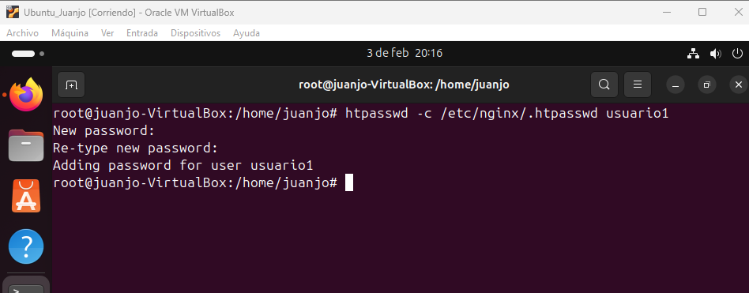

<h1 align="center"> Casos Prácticos </h1> 

*Acabamos de terminar el CFGS ASIR y encontramos trabajo en la empresa Servicios Web RC, SA en Huelva. Anteriormente utilizaban Apache como servidor web y quieren migrar a Nginx. Una vez instalado y configurado, procedemos a realizar todos los casos prácticos solicitados.*

## A) Versión de Nginx 
Para ver la versión de *Nginx*, ejecutaremos el comando `nginx -v`. 

## B) Servicio asociado 
Para comprobar que *Nginx* está instalado correctamente ejecutaremos `systemctl status nginx`. 

## C) Ficheros de configuración 
El fichero se encuentra en `/etc/nginx`. 

Y el archivo de configuración es `nginx.conf`. 

## D) Modificación de la página web 
Para modificar la página web predererminada de *Nginx* modificaremos el archivo `index.nginx-debian.html` que se encuentra en `/var/www/html/`. 

## E) Virtual hosting 
- El servidor tendrá dos sitios web, para ello crearemos dos directorios para los dos sitios web y le concederemos sus permisos correspondiente. 

 
 

- Crearemos el archivo `index.html` para los dos sitios web. 

 
 

- Crearemos los dos archivos en `sites-availables` para los dos sitios web. 

 

- Configuraremos el archivo `hosts` para los dos sitios web. 

 

- Reiniciamos el servidor y comprobaremos el resultado. 

 

## F) Autenticación, autorización y control de acceso 
El sitio web1 puede acceder desde la red interna como desde la red externa, en cambio el sitio web2 solo puede acceder mediante red interna. Para conseguir esto deberemos realizar: 

- Modificaremos los archivos web1 y web2 en `sites-availables` de cada archivo. 

 
 

- Modificaremos el archivos `hosts` para agregar las ip´s permitidas tanto para red interna como para red externa. 

- Comprobaremos la red interna.

 

- Comprobaremos la red externa.

 

## G) Autenticación, autorización y control de acceso 
*Web1.org* contiene un directorio privado al que sólo pueden acceder usuarios válidos. 

- Crearemos el usuario con el comando `htpasswd`.

 

- Modificaremos el archivo `sites-availables`. 

 

- Comprobamos que *web1.org* requiere autenticación. 

 

- Comprobamos que tenemos acceso. 
  
 

## H) Autenticación, autorización y control de acceso 
*Web1.org* contiene un directorio llamado privado, desde la red externa pide autorización y desde la red interna NO. 

- Modificamos el archivo `sites-availables`. 

 

## I) Seguridad 
Configura el sitio virtual *www.web1.org* para que el acceso sea seguro. 

- Crearemos un key privado. 

 
  
- Modificaremos el archivo `sites-availables`. 

 

## Selección de página 
[Volver](./Instalacion.md)  
[Ir a Referencias](./Referencias.md)  
