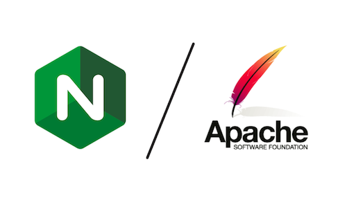

### <h1 align="center"> Nginx vs Apache: Diferencias y cuál elegir </h1>

  

Cuando se trata de servidores web, **Nginx** y **Apache** son dos de las opciones más utilizadas. Cada uno tiene sus ventajas y desventajas dependiendo del tipo de uso que se le quiera dar. En este documento, vamos a comparar ambos para elegir el que mejor se adapte a lo que necesitemos.

## Comparación entre Nginx y Apache

| Característica     | Nginx 🚀 | Apache 🏗️ |
|-------------------|---------|----------|
| **Arquitectura** | Basado en eventos (asíncrono) | Basado en procesos/hilos (sincrónico) |
| **Rendimiento** | Ideal para muchas conexiones simultáneas | Puede ralentizarse con muchas conexiones |
| **Consumo de memoria** | Bajo consumo de RAM | Mayor consumo de RAM en alto tráfico |
| **Manejo de contenido estático** | Muy eficiente y rápido | Menos eficiente en comparación con Nginx |
| **Módulos** | Menos módulos, pero optimizados | Gran cantidad de módulos disponibles |
| **Configuración** | Más sencilla pero menos flexible | Permite configuraciones avanzadas con `.htaccess` |
| **Uso recomendado** | Microservicios, proxy inverso, alto tráfico | Aplicaciones monolíticas, sitios con muchas personalizaciones |

## ¿Cuándo usamos cada uno?

- **Usa Nginx si...**
  - Necesitamos un servidor web rápido y eficiente para manejar muchas conexiones.
  - Vamos a servir mucho contenido estático como imágenes, CSS o JavaScript.
  - Queremos configurarlo como **proxy inverso** o balanceador de carga.

- **Usa Apache si...**
  - Necesitamos hacer configuraciones específicas por directorio con `.htaccess`.
  - Trabajamos con aplicaciones que ya están optimizadas para Apache.
  - Queremos con un servidor web con muchos módulos y opciones avanzadas.

## Conclusión

Si necesitamos alto rendimiento y estabilidad con muchas conexiones, **Nginx** es la mejor opción. Si buscamos flexibilidad y compatibilidad con configuraciones personalizadas, **Apache** sigue siendo una alternativa sólida. La elección dependerá del tipo de proyecto que vayamos a desarrollar.

---
