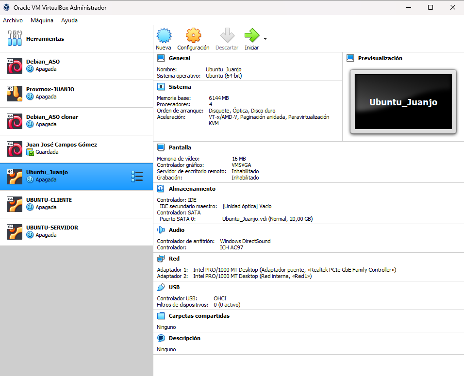
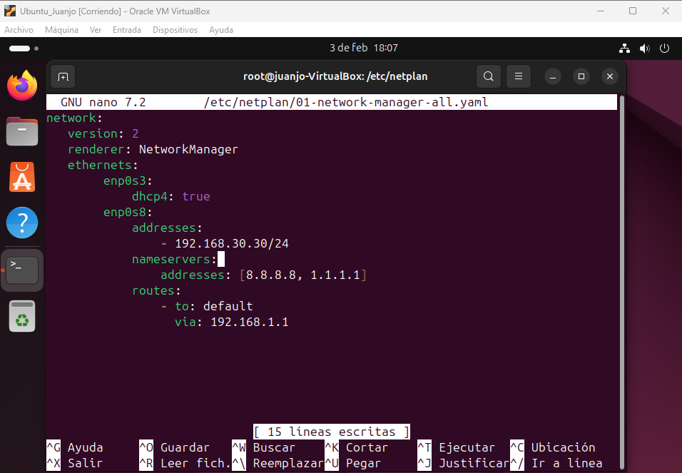
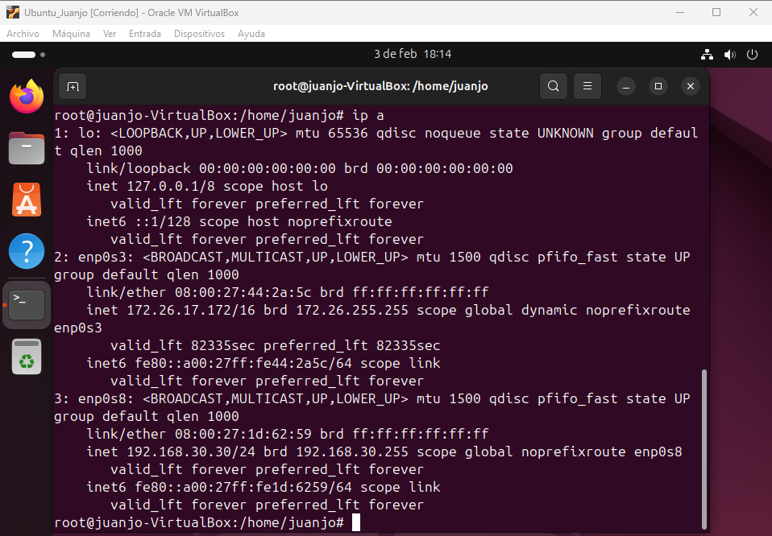

### <h1 align="center"> Configuración del Esquema de Red </h1> 

## Esquema de Red 
El servidor está configurado con dos tarjetas de red:  
- La primera red corresponderá a la enp0s3 configurada como adaptador puente. 
- La segunda red corresponderá a la enp0s8 configurada como red interna. 

 

## Configuración de las Redes 
Para la configuración de las redes tendremos que configurar su archivo en `/etc/netplan/01-network-manager-all.yaml`. Una vez configurado las redes haremos un `ip a` para comprobar que los cambios hecho en la configuración se han guardado correctamente. 
- La primera red corresponderá a la enp0s3 configurada con DHCP 
- La segunda red corresponderá a la enp0s8 configurada con IP estática.

 

 
