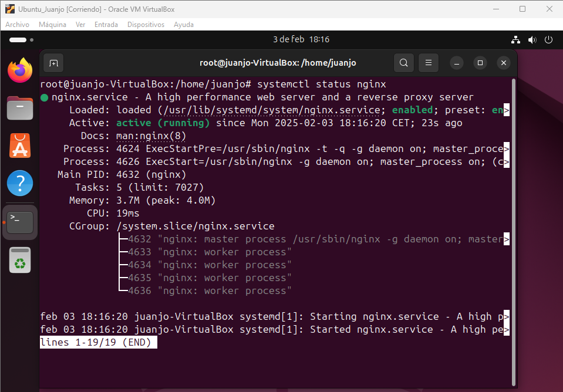

<h1 align="center"> Instalación de NGINX </h1>

En esta práctica he utilizado Ubuntu 22.04.
Para la instalación de Nginx lo primero que haremoos será un `apt update` para actualizar los paquetes y posterior haremos un `apt install nginx`, todo desde nuestra terminal de nuetsra máquina virtual. Y luego haremos un `systemctl status nginx` para comprobar que se ha instalado correctamente y se encuentra activo. 

